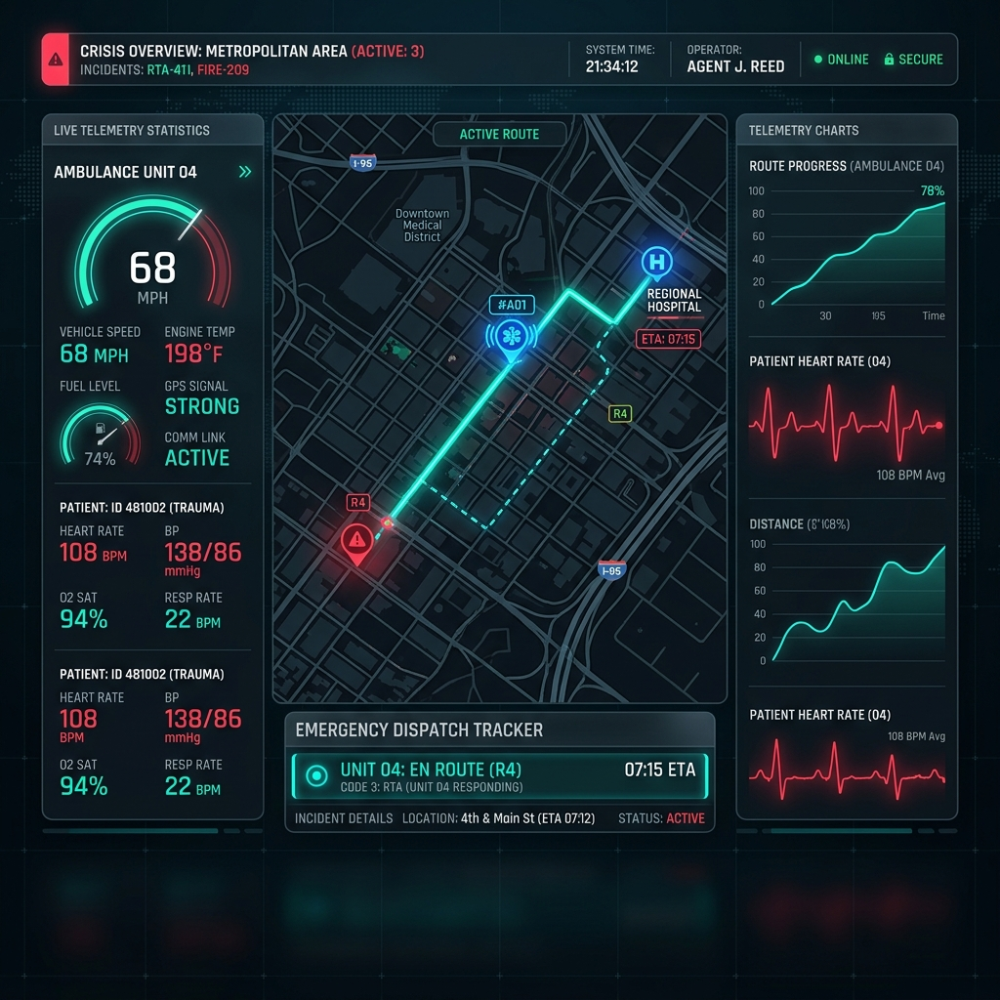
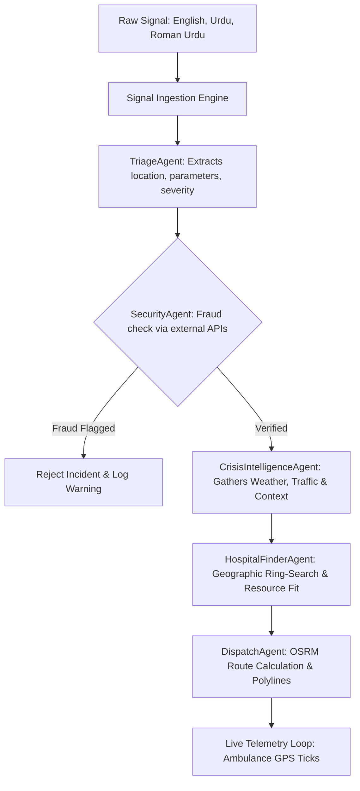

# 🌪️🚨 CIRO: Crisis Intelligence & Response Orchestrator

[](https://hackathon.example)
[](https://google.com)
[](https://irbazmemon123-crisis-intelligence-response-orche-28b6ea0.hf.space)

<p align="center">
  
</p>

> **CIRO** is a state-of-the-art, fully autonomous **Multi-Agent Emergency Rescue System** engineered to detect emerging crisis situations from noisy, unstructured real-world signals (such as social media feeds, text reports, or Urdu/English voice transcriptions) and instantly coordinate a live emergency response.

Instead of relying on slow, error-prone manual dispatch operators, **CIRO ingests raw emergency reports, autonomously performs semantic triage, runs cross-telemetry fraud validation, and dynamically dispatches optimized rescue routes.**

---

## 🌐 Live API Backend & Demonstration
The production-ready FastAPI multi-agent engine is hosted and running 24/7 on Hugging Face Spaces:
* **Live API Base URL:** [https://irbazmemon123-crisis-intelligence-response-orche-28b6ea0.hf.space](https://irbazmemon123-crisis-intelligence-response-orche-28b6ea0.hf.space)
* **API Health Check Endpoint:** `GET /` -> [Verify Server Health](https://irbazmemon123-crisis-intelligence-response-orche-28b6ea0.hf.space)

---

## 🌟 Strategic Key Features

### 🧠 1. Multilingual Semantic Ingestion (No Hardcoding)
We abandoned static "mock buttons." CIRO features a **Raw Signal Ingestion Feed**. Ingest unstructured text in **English, Urdu, or Roman Urdu** (e.g., *"Terrible multi-car accident on Shahrah-e-Faisal near FTC building. Need ICU and critical trauma support immediately."* or *"Clifton block 5 mein aag lag gayi hai"*). The Antigravity `TriageAgent` autonomously:
* Identifies geographical locations using **Nominatim API**.
* Parses crisis types and tags via semantic NLP.
* Discovers emergency parameters (such as ICU or ventilator requirements).

### 🛰️ 2. Cross-Telemetry Verification & Fraud Prevention
Before dispatching expensive emergency assets, the system runs strict validation checks. For example, if a user reports a *"severe flood in Karachi"*, the `SecurityAgent` cross-references live satellite meteorological telemetry via **Open-Meteo API** to check if heavy rain or storms are actually present in the region, preventing prank dispatches and false alarms.

### 🛡️ 3. Decoupled Multi-Agent Responding Loop
The platform distributes cognitive reasoning across a dedicated crew of specialized agents:



---

## 🛠️ System Architecture

* **Decoupled Backend:** Built with **Python + FastAPI**, orchestrating the `SystemState` schema and executing the asynchronous multi-agent pipeline.
* **Modern Cross-Platform Frontend:** Powered by **React, Vite, Tailwind CSS, and Leaflet Maps**.
* **Capacitor Hybrid Mobile Client:** Compiled into a lightweight **Android APK** featuring a futuristic, glassmorphic dark-mode command HUD.
* **Telemetry & Routing Engine:** Leverages **OSRM (Open Source Routing Machine)** to trace real-world driving polylines on the map and stream ambulance coordinates dynamically via REST polling.

---

## 🚀 Getting Started

### 📋 Prerequisites
* **Node.js** (v18+)
* **Python** (v3.10+)

### 1️⃣ Start the Backend Engine Locally
If you want to run the FastAPI server locally instead of using our hosted Hugging Face Space:
```bash
cd ciro_platform/server
pip install -r requirements.txt
python -m uvicorn main:app --host 0.0.0.0 --port 8000
```
*Your local server will spin up on `http://localhost:8000`.*

### 2️⃣ Run the Frontend (Web Dashboard)
To run the dashboard in your web browser:
```bash
cd ciro_platform/mobile-app
npm install
npm run dev
```
*Open `http://localhost:5173` to interact with the responsive dashboard.*

### 3️⃣ Build & Sync the Mobile App (Capacitor Android)
To sync your React build output to the Android Studio project and compile the APK:
```bash
cd ciro_platform/mobile-app
# 1. Compile the React assets with correct endpoints
npm run build

# 2. Sync web builds directly to the native Android folder
npx cap sync
```
*Once synced, open the `android` folder in **Android Studio** and click **Build > Build APK(s)**.*

---

## 💡 Cinematic Demo Walkthrough

1. **Ingest an Emergency:** Ingest the Roman-Urdu preset for a fire incident or type a custom unstructured emergency.
2. **Watch the Multi-Agent Triage:** See the Antigravity agents parse the signal, assign severity, check confidence scores, and display their step-by-step reasoning logs.
3. **Track Real-Time Responders:** Watch the Leaflet map as the dispatched ambulance travels along the optimal road path to the patient and carries them to safety.
4. **Inspect the Decision Matrix:** Open the "Decision Matrix" panel to see the exact hospital inventory fits (Beds, ICU space, and Ventilators) analyzed by the agents.

*Designed, engineered, and optimized for the ultimate hackathon victory.* 🏆
